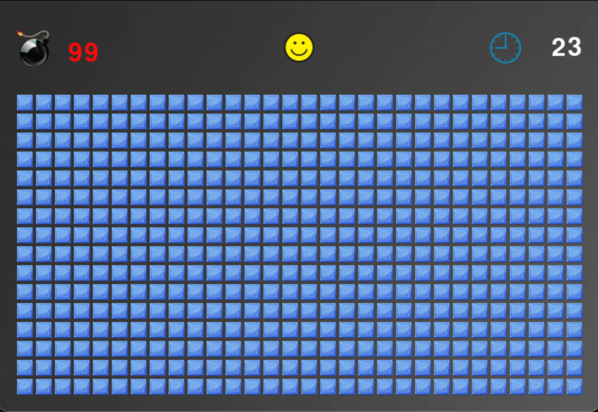

# Minesweeper game
The Windows XP version of the Minesweeper implemented in PyGame.
  

# How to start the game
Make sure to have [Python](https://python.org) installed and run `python -m pip install -r requirements` in the repository folder.

## License

Licensed under the [MIT License](https://github.com/MartinUzunov/minesweeper/blob/master/LICENSE.md).
